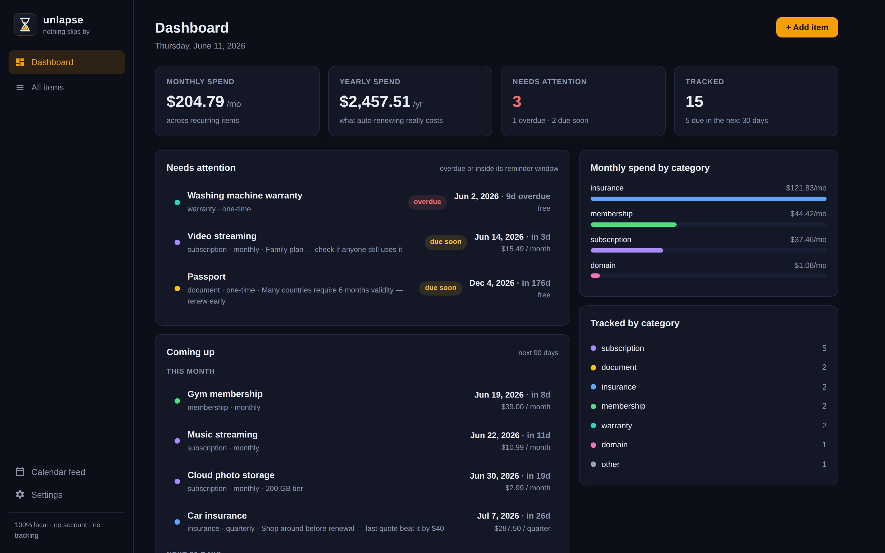
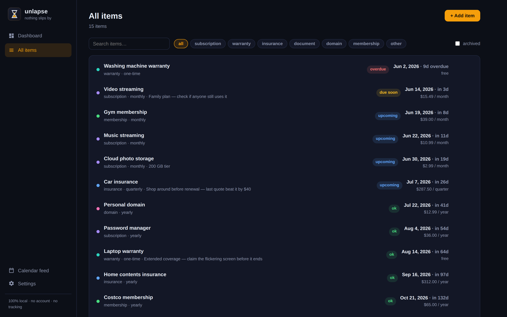
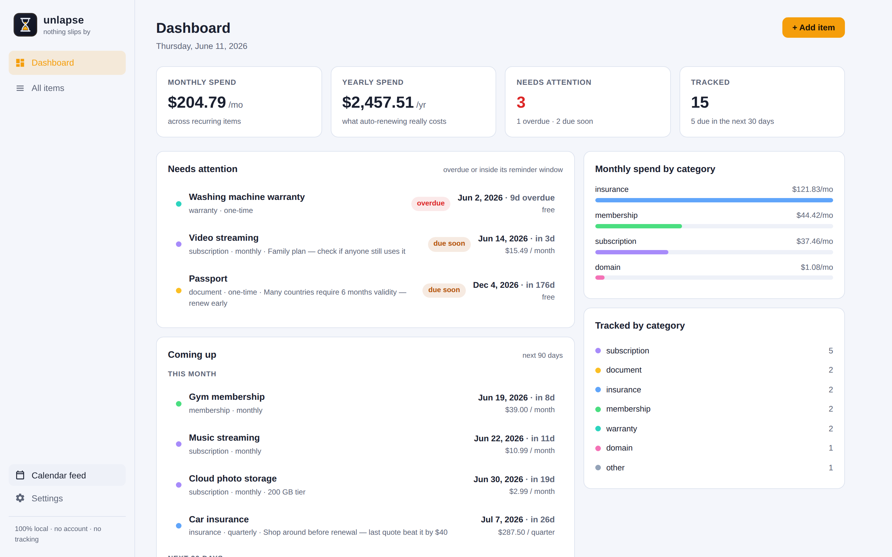
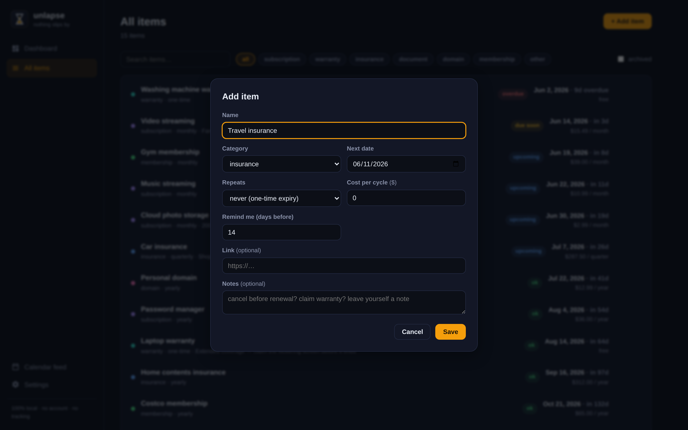
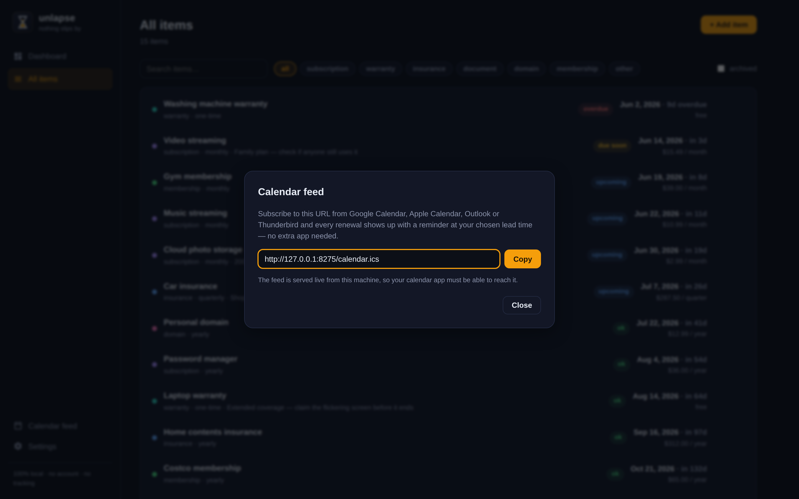

<p align="center">
  
</p>

<h1 align="center">unlapse</h1>

<p align="center"><strong>Everything in your life that expires — subscriptions, warranties, insurance, documents — on one private dashboard that warns you before money leaks or deadlines bite.</strong></p>

<p align="center">
  <a href="LICENSE"></a>
  <a href="https://github.com/DynamycSound/unlapse/releases/latest"></a>
  <a href="https://github.com/DynamycSound/unlapse/actions/workflows/ci.yml"></a>
  
  
</p>

<p align="center">
  
</p>

---

## Why

The average household quietly bleeds money and misses deadlines because nothing
keeps watch:

- The **VPN that doubles in price** after the intro year and auto-renews anyway.
- The **streaming plan nobody watches** that's been billing for 14 months.
- The **laptop warranty** that expires three weeks before the screen dies.
- The **passport** you discover is invalid at the airport, because many
  countries require six months of remaining validity.
- The **car insurance** that renews at a "loyalty" price 30% above the quote
  you'd get as a new customer.

Paid services like Rocket Money sell this exact peace of mind for a monthly
fee — and they want your bank login and your data in their cloud to do it.

**unlapse** does it as a single small program on your own computer.
No account. No bank access. No cloud. No tracking. One binary, one JSON file,
done.

## Features

- **One dashboard for everything that lapses** — subscriptions, warranties,
  insurance, documents, domains, memberships, and anything else with a date.
- **Real renewal math** — monthly, quarterly, yearly, weekly, or every-N-days
  cycles roll forward correctly (yes, including month-end dates and leap years),
  and one-time items go properly *overdue*.
- **See what auto-renewing really costs** — every cost is normalized into
  monthly and yearly spend, broken down by category, so the "it's only $4.99"
  subscriptions add up in front of you.
- **Reminders in the calendar you already use** — subscribe to the built-in
  iCalendar feed from Google Calendar, Apple Calendar, Outlook, or Thunderbird
  and every item shows up with an alarm at your chosen lead time. No extra
  notification service to babysit.
- **Per-item reminder windows** — remind me 180 days before the passport, 5
  days before the streaming renewal.
- **Your data is one readable file** — a single human-readable JSON file you
  can back up, sync, or grep. CSV import/export for spreadsheet people.
- **Dark and light themes**, archive instead of delete, search and filters,
  sample data to explore before committing.

| All items | Light theme |
|---|---|
|  |  |

| Add an item | Calendar feed |
|---|---|
|  |  |

## Installation

unlapse is a single executable, about 6 MB, with zero dependencies.

### Windows

1. Download `unlapse-vX.Y.Z-windows-amd64.exe` from the
   [latest release](https://github.com/DynamycSound/unlapse/releases/latest).
2. Put it in a folder you like (your data file is created next to it) and
   double-click it.
3. Open **http://localhost:8275** in your browser. That's it.

> Windows SmartScreen may warn because the binary isn't code-signed (signing
> certificates cost money; this project is free). Click **More info → Run
> anyway**, or build from source below.

### macOS

```bash
# Apple Silicon (M1/M2/M3/M4): darwin-arm64 · Intel: darwin-amd64
curl -LO https://github.com/DynamycSound/unlapse/releases/latest/download/unlapse-v1.0.0-darwin-arm64
chmod +x unlapse-v1.0.0-darwin-arm64
xattr -d com.apple.quarantine unlapse-v1.0.0-darwin-arm64   # unsigned binary
./unlapse-v1.0.0-darwin-arm64
```

### Linux

```bash
curl -LO https://github.com/DynamycSound/unlapse/releases/latest/download/unlapse-v1.0.0-linux-amd64
chmod +x unlapse-v1.0.0-linux-amd64
./unlapse-v1.0.0-linux-amd64
```

### Docker

```bash
docker run -d --name unlapse -p 8275:8275 -v unlapse-data:/data \
  $(docker build -q https://github.com/DynamycSound/unlapse.git)
```

Then open **http://localhost:8275**.

## Usage

- Click **+ Add item**, give it a name, a category, the next renewal/expiry
  date, how often it repeats, and what it costs. Done.
- The **Dashboard** shows what needs attention now, what's coming in the next
  90 days, and what your recurring life actually costs per month and year.
- Click **Calendar feed** in the sidebar and subscribe to the URL from your
  calendar app to get reminders on your phone with zero extra infrastructure.
- **Settings** lets you change currency symbol, default reminder lead time,
  theme, and import/export CSV.
- New install? Hit **Load sample data** to explore with realistic data, then
  delete what you don't need.

### Options

```text
unlapse --addr 127.0.0.1:8275   # listen address (0.0.0.0:8275 to reach it from your phone)
        --data unlapse-data.json # where your data lives
        --version
```

Environment variables `UNLAPSE_ADDR` and `UNLAPSE_DATA` work too.

## Privacy

**Everything stays on your device.** unlapse makes zero network requests —
no accounts, no cloud sync, no analytics, no telemetry, no update checks, no
fonts or scripts loaded from CDNs. The compiled binary contains the entire app.
Your data is one JSON file on your disk that you can read, back up, and delete.
By default it listens only on `127.0.0.1`, unreachable from the network.

## Building from source

Requires Go 1.22+. No other toolchain, no npm, no build step:

```bash
git clone https://github.com/DynamycSound/unlapse
cd unlapse
go build -o unlapse ./cmd/unlapse
./unlapse
```

Run the tests with `go test ./...`, or build every platform with
`scripts/build-release.sh`.

## Contributing

Issues and PRs are welcome — see [CONTRIBUTING.md](.github/CONTRIBUTING.md).
The ground rules: zero runtime dependencies, local-first forever, everything
ships working.

## License

[MIT](LICENSE) — free to use, modify, and distribute, for anyone, forever.
